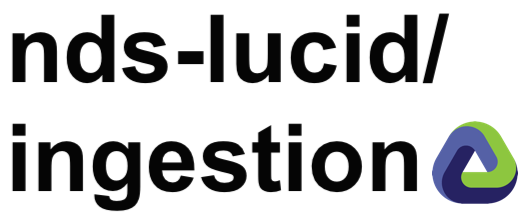
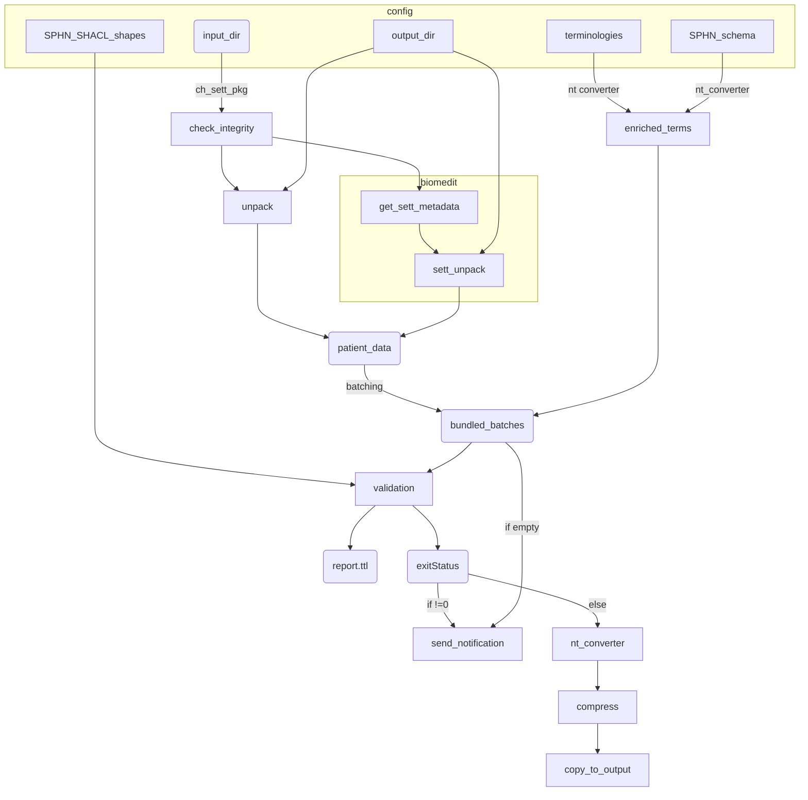

# 


[](https://www.nextflow.io/)
[](https://podman.io/)


## Context

This repository includes "digital infrastructure" code from a Swiss [National Data Stream (NDS)](https://sphn.ch/services/funding_old/nds/): LUCID. The general goal of the NDS initiative is to collect clinical data across five Swiss University Hospitals and share it with researchers. In the case of LUCID, research focuses on low-value care: services that provide little or no benefit to patients. If you're interested, check the [official project page](https://sphn.ch/network/projects/project-page_nds_lucid/).

## Code overview

This repository provides an automated pipeline to perform (RDF) data validation with two flows:

  - Success: upon successful validation, data is provided in the output folder
  - Failure: upon unsuccessful validation, a report is generated in the notification folder

The code was first built around the [BioMedIT](https://www.biomedit.ch/) environment, but to allow re-usability, most software and tools rely on public containers, meaning that there are few requirements to test it on any machine (see Requirements section).

The sections below provide more technical details about the pipeline, its implementation and use.  
For any question, feel free to [open an issue](https://github.com/sdsc-ordes/nds-lucid-ingestion/issues) or [contact us directly](https://www.datascience.ch/contact).

## Workflow framework

The pipeline is built using [Nextflow](https://www.nextflow.io), a workflow tool to run tasks across multiple compute infrastructures in a very portable manner. It uses `podman` containers making installation trivial and results highly reproducible. The [Nextflow DSL2](https://www.nextflow.io/docs/latest/dsl2.html) implementation of this pipeline uses one container per process which makes it much easier to maintain and update software dependencies.

## Requirements

By default, the workflow assumes that:
* [`Nextflow`](https://www.nextflow.io/docs/latest/getstarted.html#installation) is installed (`>=22.10.1`)
* [`Podman`](https://podman.io/) is installed for full pipeline reproducibility
* Basic UNIX libraries are installed: `gzip`, `cat`, `unzip`, `md5sum` and `fdfind`
  
With the `biomedit` profile, in addition to the points above, the workflow assumes that:
* [sett-rs](https://gitlab.com/biomedit/sett-rs) is installed with the command-line interface available (`sett-cli`)
* A [Nextflow secret](https://www.nextflow.io/docs/latest/secrets.html) `SETT_OPENPGP_KEY_PWD` is set to provide the secret OpenPGP key used to decrypt data
* [`jq`](https://jqlang.github.io/jq/) is installed and available

See [usage instructions](docs/usage.md) for more information.


## Pipeline summary

<!-- TODO nf-core: Fill in short bullet-pointed list of the default steps in the pipeline -->

1. Check for new `zip` files or rerun worfklow on current `zip` files in source directory
2. Decrypt and decompress files to extract datasets
    - With the `biomedit` profile, metadata is extracted and used to rename the datasets' directory
3. Create batches of data with sizes defined in `nextflow.config`
4. One by one, each data batch is bundled with external terminologies and validated using SPHN SHACL rules:  
   a. For invalid or empty batches: create a file with datasets and their error in a notification folder  
   b. For valid batches: continue to steps 5-7
5. Convert valid datasets to `nt` format
6. Compress all `nt` files into `gzip`
7. Move `gzip` to output directory



## Quick Start

See [usage docs](./docs/usage.md) for all of the available options when running the pipeline. 

1. Download the pipeline and test it on a minimal dataset with a single command:

   ```bash
   nextflow run main.nf -profile standard,test
   ```

   Note that some form of configuration will be needed so that Nextflow knows how to fetch the required software. This is usually done in the form of a config profile (`test` in the example command above). You can chain multiple config profiles in a comma-separated string.

2. Start running your own analysis!

   <!-- TODO nf-core: Update the example "typical command" below used to run the pipeline -->

   ```bash
   nextflow run main.nf -profile standard,test --input_dir /data/source --output_dir /data/target --notification_dir /data/notification --shapes /data/shapes
   ```

## Production use

To use `ingestion` within the [BioMedIT system](https://www.biomedit.ch/), we advise pointing the Nextflow working directory to a folder on a separate partition with sufficient volume and appropriate permissions. 
For the pipeline constantly monitoring for incoming data:

```
nextflow run main.nf -profile biomedit -w /data/work/
```
For the pipeline to re-run on already landed data:

```
nextflow run main.nf -profile biomedit -w /data/work/  --rerun=true
```

## Credits

nds-lucid/ingestion was originally written by Stefan Milosavljevic and Cyril Matthey-Doret.


## Citations

This pipeline uses code developed and maintained by the [nf-core](https://nf-co.re) community, reused here under the [MIT license](https://github.com/nf-core/tools/blob/master/LICENSE).

> **The nf-core framework for community-curated bioinformatics pipelines.**
>
> Philip Ewels, Alexander Peltzer, Sven Fillinger, Harshil Patel, Johannes Alneberg, Andreas Wilm, Maxime Ulysse Garcia, Paolo Di Tommaso & Sven Nahnsen.
>
> _Nat Biotechnol._ 2020 Feb 13. doi: [10.1038/s41587-020-0439-x](https://dx.doi.org/10.1038/s41587-020-0439-x).
